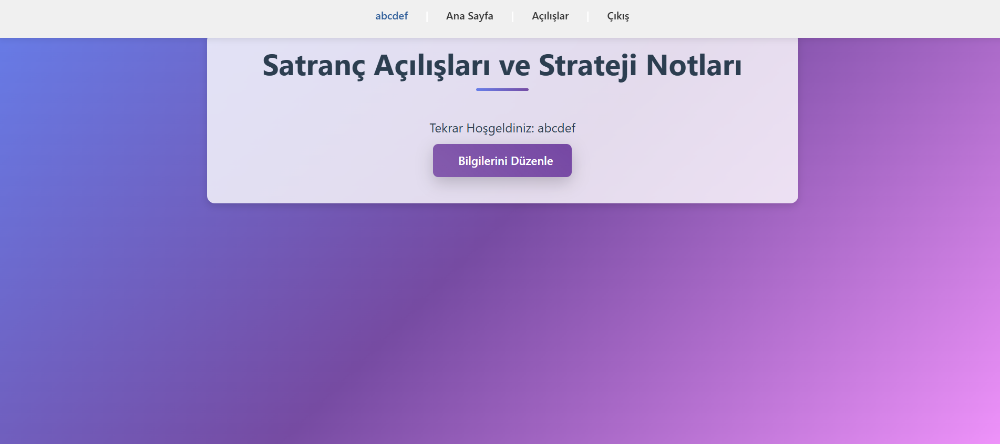
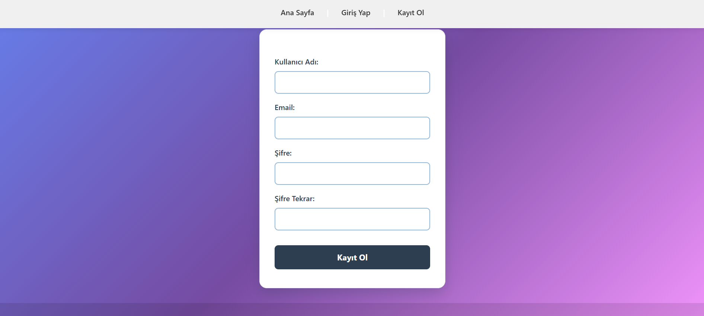
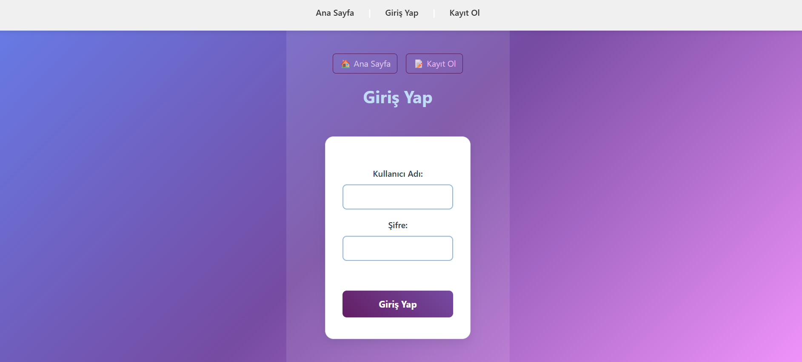
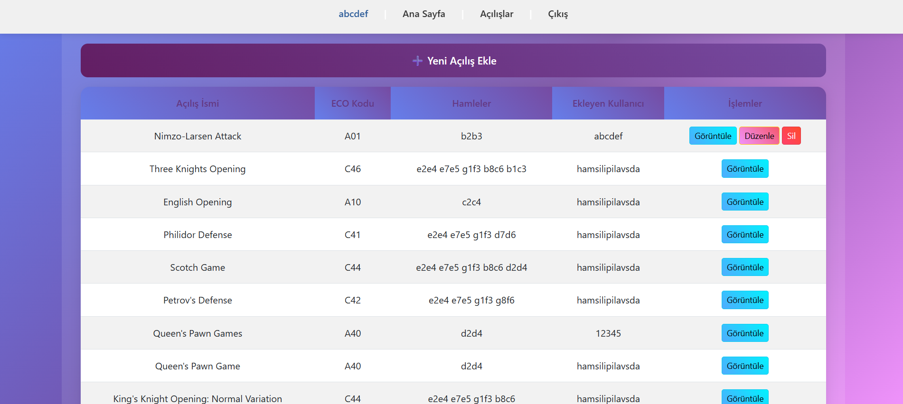
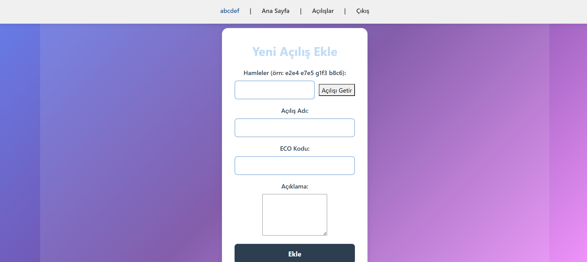
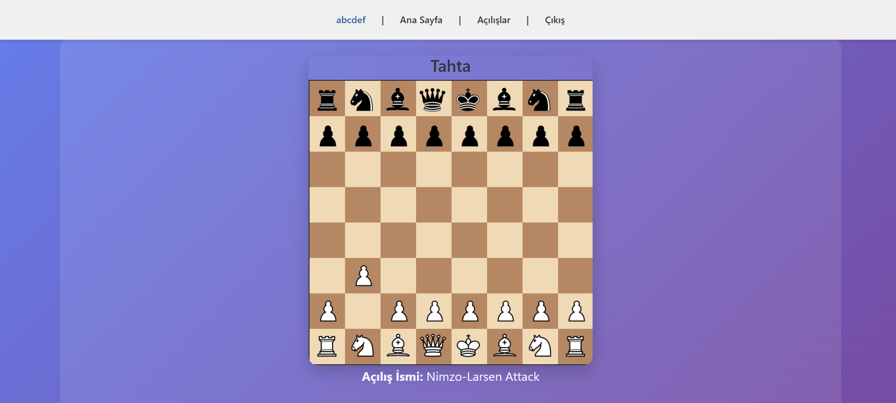
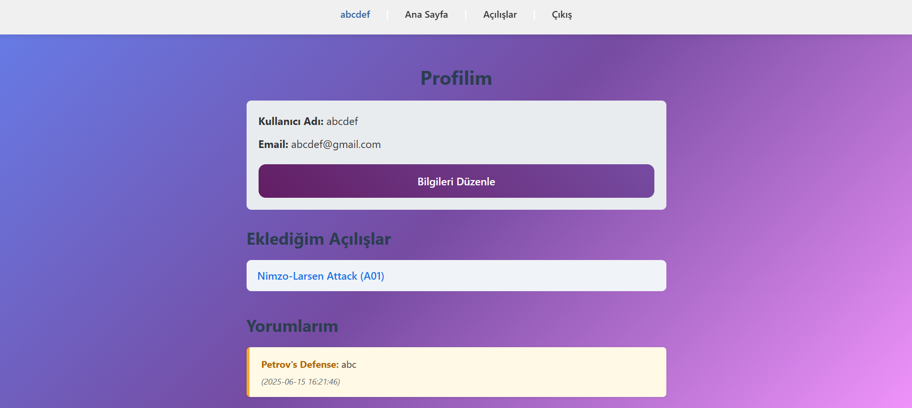
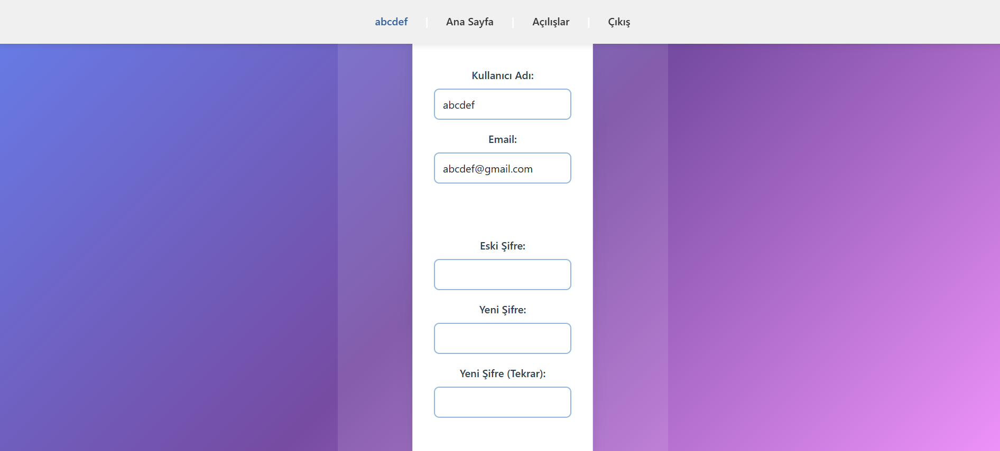

# ♟️ Satranç Açılışları ve Stratejik Notlar Uygulaması
Bu proje, satranç açılışlarını öğrenmek ve kullanıcılar arasında stratejik fikir alışverişini sağlamak amacıyla geliştirilmiş bir web uygulamasıdır. Kullanıcılar sisteme kayıt olabilir, giriş yapabilir, açılışları inceleyebilir ve kendi stratejik yorumlarını paylaşabilirler.

## 📁 Erişim
Herhangi bir özel kurulum gerekmez. Proje PHP destekli bir sunucu üzerinde çalışacak şekilde geliştirilmiştir. Github Pages aracılığıyla ulaşabilirsiniz.  
[Github Pages]() 
[Demo Videosu](https://www.youtube.com/watch?v=3bnkE2M5e94)  

## 🚀 Özellikler
✅ Kullanıcı kayıt ve giriş sistemi 
✅ Kullanıcı bilgilerini (kullanıcı adı, e-posta, şifre) güncelleme 
✅ Açılışları görüntüleme ve yeni açılış ekleme 
✅ Lichess Public API ile otomatik açılış adı ve ECO kodu alma 
✅ Hamleleri yazarak tahtada oynatma 
✅ Açılışa stratejik yorumlar ekleyebilme 
✅ Yorum düzenleme ve silme 
✅ Kendi eklediği açılışları silme 
✅ Profil sayfasında kullanıcının açılış ve yorum geçmişini görme 
✅ Güvenli oturum açma / kapatma  

## 🛠️ Kullanılan Teknolojiler
**Frontend**: HTML, CSS   
**Backend**: PHP   
**Veritabanı**: MySQL (tablolar: users, comments, openings)   
**API**: [Lichess Opening Explorer API](https://explorer.lichess.ovh/masters?play=e4,e5,Nf3,Nc6)  

## 📸 Ekran Görüntüsü
### Ana Sayfa
 

### Kayıt Olma
 

### Giriş Yapma
 

### Açılışlar
 

### Açılış Ekle
 
 

### Açılış Düzenle
 
 

### Profil
  

### Bilgileri Düzenle
  

## 🔍 Kullanım
🍂Siteye kayıt ol veya giriş yap. 
🍂'Açılışlar'a gir. 
🂓Yeni Açılış Ekle†butonuna tıkla. 
ğŸ‚Örnekteki gibi hamleleri yaz ve “Açılışı Getir†butonuna tıkla. 
🍂Açılış adı ve ECO kodu otomatik olarak alınır, hamleler tahtada oynatılır. 
🍂Açıklama yazarak açılış hakkında stratejik notunu ekle. 
🍂Başka kullanıcıların açılışlarına yorum yapabilir, gerektiğinde yorumlarını silebilirsin. 
🍂Profilinden bilgilerini güncelleyebilir ve geçmiş yorum/açılışlarını görebilirsin.  

## 🔐 Giriş Yapmadan Yapılamayanlar
🍃Açılış ekleme 
🍃Yorum yapma / düzenleme / silme 
🍃Profil görüntüleme  

